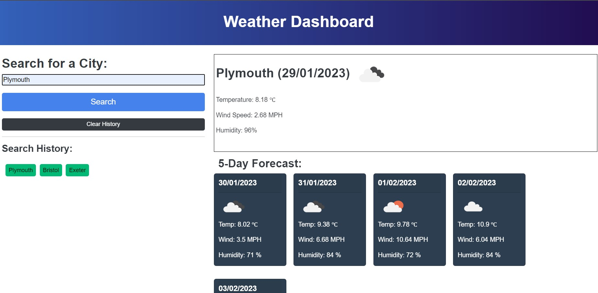

# Interactive-5-day-weather-forecast

## Description
This app will allow you to search any city name in the world to see today's weather forecast as well as the next 5 days. As many travelers, seasoned or armature, love to research multiple locations before booking their tickets, this app remembers what the user searched for and allows them to quickly re-search a city at the press of a button.

Demonstrating all of the JavaScript learnt so far, this simple (on the outside) weather forecast app takes a user's input and returns a 5-day weather forecast from the openweathermap API.

## Usage

Visit the app here

Simply enter a city name in the search box and hit enter to see the forecast. Press a search history button to show the weather for that particular search term again. Don't worry, you can't add the same search to the history more than once - no wasted space showing the same searches multiple times. Want to clear your search history? Easy! Simply click 'clear history' and you're back to a blank canvas.

Here's what you'll see:

